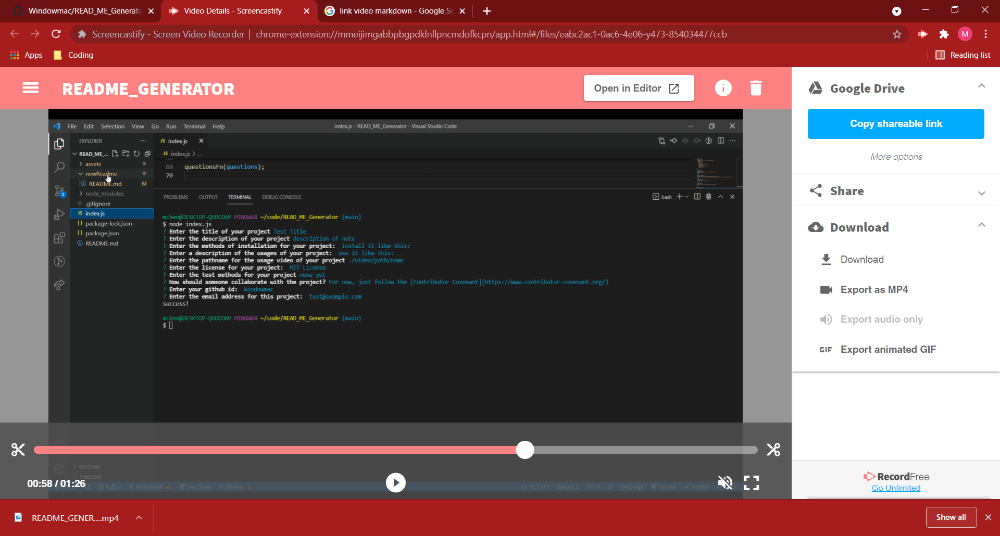

# README GENERATOR
  

  ## Description:
  ___
  A program that eases the burden on the developer by dynamically generating a readme from console command inputs. It generated this README!

  ## Table of Contents:
  ___
  1) [Description](#description)
  2) [Installation](#installation)
  3) [Usage](#usage)
  4) [Video](#video)
  5) [Collaboration](#collaboration)
  6) [Tests](#tests)
  7) [Questions?](#questions?)
  8) [GitHub](#gitHub)
  9) [License](#license)

  ## Installation
  ___
  Fork and clone the repository then run index.js from your console.

  ## Usage
  ___
  using an inquirer-based question-answer system, generates a README file in the newReadme folder that can be copy/pasted to any project.

  ## Video
  ___
  

  ## Collaboration:
  ___
  For now, just follow the [Contributor Covenant](https://www.contributor-covenant.org/)

  ## Tests
  ___
  none yet

  ## Questions?
  ___
  Please contact me at:
  My [GitHub](https://github.com/Windowmac)
  
  Or Email:
  <mckendree.strommer@gmail.com>

  
  ## License: 
  ___
  Licensed under [Mozilla Public License 2.0](https://opensource.org/licenses/MPL-2.0)